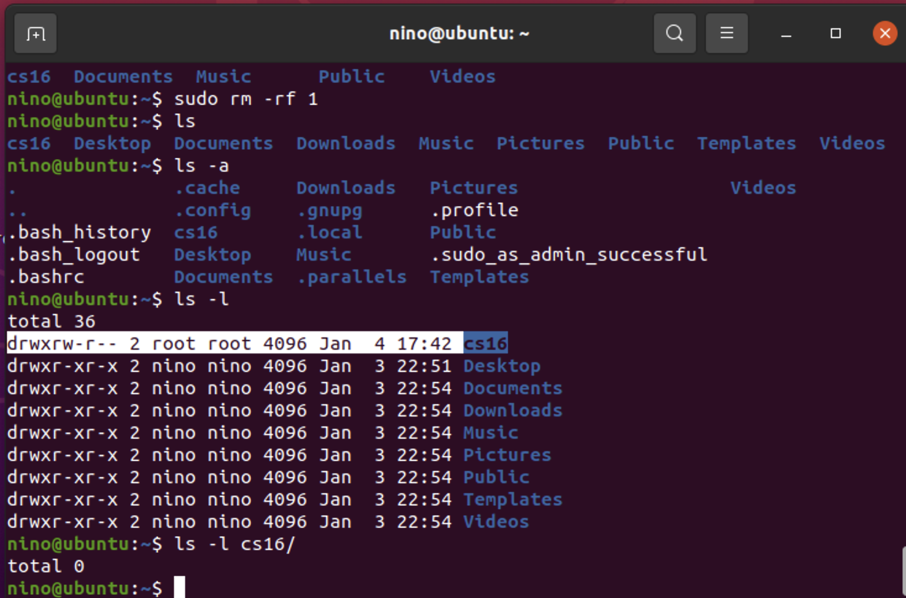
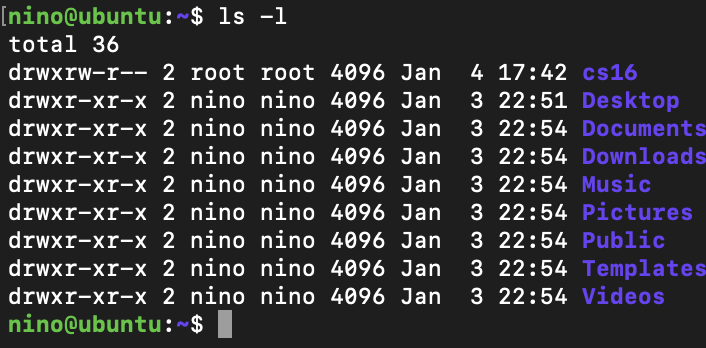
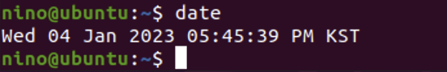
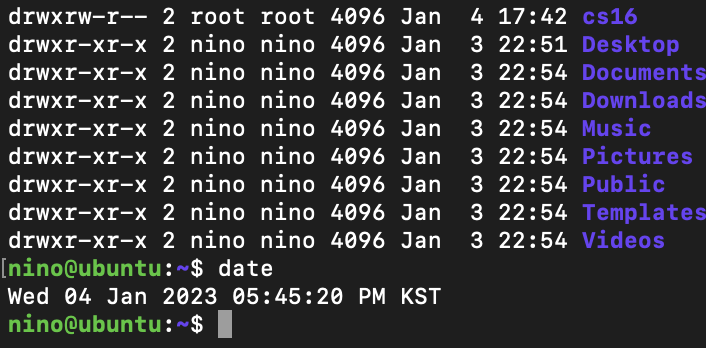
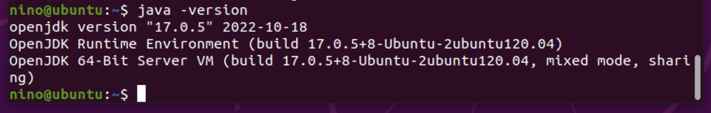
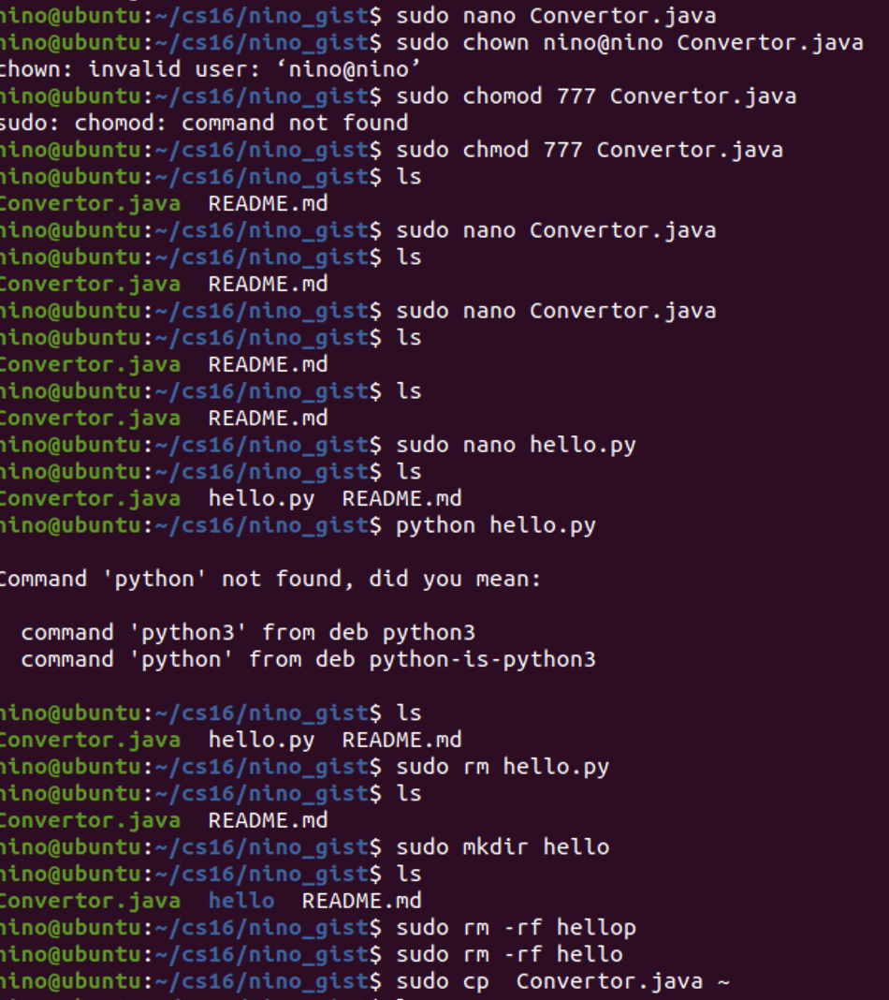

### 개발 환경과 데이터 구조
1. 2진법,16진법 문제 풀기
- [x] 값을 변환하는 함수를 선언하고, 변환할 값을 전달하는 상위 함수와 변환한 값을 출력하는 함수를 분리해서 작성한다.
2. 리눅스 설치
- [x] (선택1) 맥북에 페러럴즈 이용해서 설치하기
- [ ] (선택2) 윈도우에 usb에 리눅스 이미지 파일 받아서 설치하기
-------------
## 가상 환경 설치하기
- [x] 가상환경에 리눅스 설치(우분투 20.04이상) 초보자면 데스크탑 추천
- [x] ssh 설정, root 계정 이외 본인 접속할 계정 추가
- [x] 본인 계정에 대한 패스워드 설정
- [x] 로컬 컴퓨터에서 가상 환경 리모터 컴퓨터에 ssh로 접속해서 본인 계정 로그인
- [x] 본인 계정에서 ```/cs16``` 디렉토리를 생성하고 ```764```모드로 접근 권한을 바꿔서, 본인 계정으로 쓸 수 있도록 설정한다
- [x] 가상 환경에서 터미널을 열고 ```/cs16```경로에 대해 권한을 확인하는 화면 캡쳐
- [x] 가상 환경에 오늘 날짜 + 서울 시간대로 지정해서 로컬과 가상 환경이 동일하도록 맞춘다
- [x] 가상 환경에서 터미널을 열고 date 명령으로 오늘 날짜를 출력한 상태로 화면 캡쳐
- [x] 가상 환경에 클래스별 컴파일러 또는 개발자 도구를 설치하고 버전을 출력한 상태로 화면 캡쳐
  - BE : Java JDK 16+
- [x] 가상 환경에 직접 설치
- [ ] sumBinary() 함수를 리모트에서 작업하고, 리모트에서 빌드해서 실행할 수 있어야 한다
-----------
### 눈물의 우분투 설치기
나는 패러럴즈 17을 영구버전을 구매해서 사용했다(사실 구매해놓고 쓴 적이 없다)
이번 미션을 진행하면서 인터넷에 18버전 체험판으로 깔길래 나도 해봤다가
어디서 오류가 난지 모르겠으나 뻑이나버렸다
화딱지나서 시스템 파일을 다 삭제했는데 그 중 패러럴즈 시스템 파일이 포함되어 있었다
패러럴즈 재설치하고 우분투 설치하는데 3시간 걸렸다(감동실화임)
내가 참고한 사이트는 [여기](https://conceptbug.tistory.com/entry/Ubuntu-%EB%A7%A5-OS%EC%97%90-Parallels-%EA%B0%80%EC%83%81-%EB%A8%B8%EC%8B%A0%EC%9C%BC%EB%A1%9C-Ubuntu-%EC%84%A4%EC%B9%98%ED%95%98%EA%B8%B0-1
)

---------------

### 1. Parallels Desktop에 Ubuntu 설치

------------------------
- Parallels Desktop 17
- Ubuntu 20.04 desktop 설치
---------------
### 2. ssh 설정, root 계정 이외 본인 접속할 계정 추가

----------
1. ssh 설정
```ssh 아이디@아이피주소```
아이피 주소는 가상환경에서 접속한 우분투에서 ifconfig 를 입력한다
enp0 쪽에 나와있는 ip주소를 가져오면 된다
2. 계정 추가
```sudo adduser 이름```
만약 경고가 뜬다면 당황하지 않고 위 명령어에``` --force-badname```을 추가한다
우분투가 이름을 맘에 안들어할 확률이 높기 때문이다

-------------
### 3. 본인 계정에서 ```/cs16``` 디렉토리를 생성하고 ```764```모드로 접근 권한 바꾸기
```sudo chmod 764 cs16/``` 으로 만들었다. 맨 처음에 메인에서 만들었다가 오류가 나서
home/이름/cs16 폴더 경로로 타고 들어갈 수 있게 만들었다.

---------------








참고로 우분투에서 history 입력하면 내가 입력한 명령어들을 볼 수 있다
리눅스.. 정말 쉽지않다
<pre>    1  ls
    2  cd /
    3  ls
    4  cd ~
    5  ls
    6  pwd
    7  cd ..
    8  ls
    9  cd ..
   10  ls
   11  cd ~
   12  cd /
   13  sudo adduser 2nino
   14  sudo adduser 2nino --force-badname
   15  exit
   16  ls
   17  cd /
   18  ls
   19  cd usr
   20  pwd
   21  cd ..
   22  cd ~
   23  ls
   24  pwd
   25  sudo mkdir 1
   26  ls
   27  cd 1
   28  pwd
   29  cd /
   30  ls
   31  cd usr
   32  pwd
   33  cd ~
   34  ls
   35  exit
   36  sudo apt update
   37  sudo apt upgrade
   38  sudo apt autoremove
   39  ifconfig
   40  ip a
   41  sudo apt update
   42  sudo apt install openssh-server
   43  sudo systemctl status ssh
   44  whoami
   45  ifconfig
   46  sudo apt-get install net-tools
   47  history
   48  ifconfig
   49  sudo apt-get update
   50  history
   51  ifconfig
   52  sudo adduser 2nino
   53  ifconfig
   54  ls
   55  sudo rm -rf 1
   56  ls
   57  ls -a
   58  ls -l
   59  ls -l cs16/
   60  date
   61  ls
   62  sudo mv cs16/ /cs16
   63  ls
   64  cd /
   65  ls
   66  cs16
   67  ls
   68  cd cs16/
   69  sudo chmod 764 cs16/
   70  ls
   71  cd cs16/
   72  sudo mv cs16/ ~/
   73  cd ~
   74  ls
   75  cd cs16/
   76  sudo chmod 777 cs16/
   77  ls
   78  cd cs16/
   79  ls
   80  cd ..
   81  sudo chmod 764 cs16/
   82  ls
   83  cd cs16/
   84  ls
   85  sudo rm -rf cs16/
   86  sudo mkdir cs16
   87  sudo chmod 764 cs16/
   88  ls
   89  cd cs16/
   90  ls
   91  sudo rm -rf cs16/
   92  ls
   93  mkdir cs16
   94  sudo chmod 764 cs16/
   95  cd cs16/
   96  ls
   97  cd ..
   98  cd cs16/
   99  git clone git@gist.github.com:afaee9b5f110631e47ddd45a40156327.git
  100  ls
  101  cd
  102  ls
  103  cd ..
  104  ls
  105  cd cs16/
  106  ls
  107  cd nino_gist/
  108  history
</pre>

이만큼을 썼다..
참고로 리눅스 환경에선 nano를 사용하면 좀 더 쉽게 이용이 가능하다
<pre>sudo apt-get install nano</pre>

이런식으로 사용하면 된다.

-------------------------

### 학습목표

------------------------
1. 로컬에 통합 개발 환경을 설정한다
2. 진법 변환을 위한 코드를 작성하고 빌드해서 동일하게 동작하는 것을 확인한다
3. 디버거로 브레이크 포인트를 지정하고 스텝-오버, 스텝-인, 넥스트 명령을 실습하나
4. 작업한 소스 코드를 gist에 단계별로 commit, push 할 수 있다
- 스스로 할 일을 체크리스트로 만든다
- 단계를 진행하면서 작업한 명령어, 스크린 캡처, 진행 과정, 실행 결과를 체크리스트를 체울때마다 마크다운 문법으로 업데이트
  - 소스파일, 문서와 이미지 등을 모두 포함해서 시크릿 기스트에 저장
  - 컴파일한 바이너리 실행 파일은 포함하지 않는다
